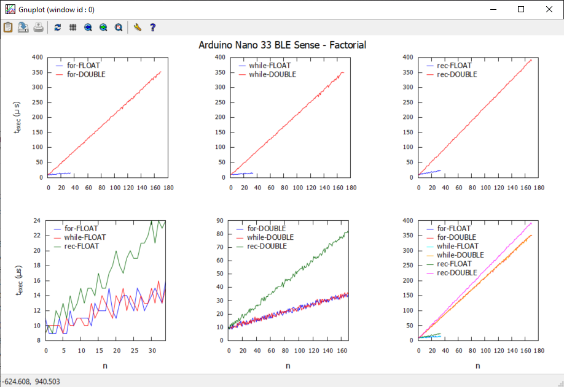

# Física Aplicada à Computação

## Licenciatura em Engenharia Informática - 1º Ano / 1º Semestre

### Ano Lectivo 2024-25

### Docente: Nuno S. A. Pereira | <nuno.pereira@ipbeja.pt>

---

### Introdução

---

O **Markdown** é uma _markup language_ criada por ***John Gruber*** em 2004. A sua simplicidade permite criar rapidamente documentos com uma formação eficiente e, acima de tudo, portáveis.

A maior motivação em usarmos o **Markdown** é permitir que nos foquemos no conteúdo e menos na forma. Queremos que a mensagem seja transmitida de forma clara mas não queremos ser distraídos com detalhes de formação que são comuns nos editores de texto [WYSIWYG](https://en.wikipedia.org/wiki/WYSIWYG). Este foir o principal motivo que me levou a considerar a utilização desta linguagem para a elaboração do realtório desta unidade curricular.

### Funcionalidades básicas 

---

Tudo o que está a ser exemplficado neste documento pode ser consultado neste [site.](https://www.markdownguide.org/) mas achei que era boa ideia condensar o mais importante num único documento para facilitar a vossa entrada no **Markdown**. 

Quando estiverem a ler o documento vão perceber como estão definidos os parágrafos, o uso de **bold** e de _itálico_ ou, ainda, ***bold & itálico***. Passemos agora a outro tipo de formatação como, por exemplo, _blockquotes_

>"Só sei que nada sei..."

e _nested blockquotes_ 

> "este é o primeiro nível"
>> "e este é o segundo"
>>> "até podemos ter um terceiro"

Outra estrutura que dá muito jeito são as listas, quer sejam as ordenadas:

1. Primeiro item
1. Segundo item
1. Terceiro item

ou as não ordenadas:

- Primeiro item
- Segundo item

que também poder ser definidas assim:

* Primeiro item
* Segundo item

ou ainda assim:

+ Primeiro item
+ Segundo item

Não devem misturar o tipo de marcador quando definem listas ordenadas. Vejam o efeito:

- Primeiro item
* Segundo item
+ Terceiro item

Aparecem espaços adicionais entre as linhas porque é como se cada linha pertencesse a listas diferentes.

Podemos misturar listas e _blockquotes_, por exemplo:

- Primeiro item
- Segundo item

    > "isto é um bloco dentro de uma lista"

- Terceiro item

### Apresentação de código

---

Tratando-se de uma unidade curricular onde vamos programar, é importante saber como listar código dentro de um documento **Markdown**. Um bloco de código deve estar identado 4 caracteres (um _tab_), como o exemplo abaixo de um _sketch_ Arduino


    void setup() {
        // put your setup code here, to run once:
    }

    void loop() {
        // put your main code here, to run repeatedly:
    }

Para nos referirmos a um exemplo de código no texto podemos usar os _backticks_ assim: `Serial.println()`. Alternativamente, um bloco de código também pode ser definido com _backticks_:
```
import numpy as np
import pandas as pd
```

### Equações matemáticas

---

A Física não se faz sem equações e por isso é importante podermos escrevê-las de forma rápida e eficiente dentro do documento. Para isso recomendo a instalação da extensão [Markdown+Math][1] que permite incluir comandos [LaTeX][2]. Para aprenderem o básico podem visitar este [site][3], mas neste documento vamos mostrar como se definem equações de forma simples.

[1]: https://marketplace.visualstudio.com/items?itemName=goessner.mdmath

[2]: https://www.latex-project.org/

[3]: https://www.learnlatex.org/pt/

#### 1. Equações algébricas
A equação da recta é $y = ax +b$, em que $a$ é o declive da recta e $b$ a sua ordenada na origem.Se quisermos considerar uma equação do 2º grau então  teremos, $ax^{2}+bx+c$, cuja solução é dada pela bem conhecida fórmula resolvente:
$$
x = \frac{-b \pm \sqrt{b^{2}-4ac}}{2a}\:.
$$
Por exemplo, um polinómio de grau $n$ pode ser definido assim:
$$
p(x) = \sum_{k=0}^{n} a_{k}x^{k}\:.
$$

#### 2. Equações integrais e diferenciais
O **LaTeX** permite escrever equações integrais com grande facilidade:

$$ \int_{0}^{\infty} \phi(x)e^{-x^{2}}\;dx + \frac{\sin(x)}{x} = \int_{-\infty}^{\pi} \psi(x)\cos(x)\:dx.$$

No caso de equações diferenciais também não é difícil, por exemplo a equação diferencial ordinária de 2º grau

$$m\ddot{x} + \omega^{2} x = 0\:,\:\:\: \omega=\sqrt{k/m},$$

descreve um sistema [mola-massa][4], em que uma massa $m$ está pendurada numa mola com constante $k$. A constante $\omega$ designa-se _frequência angular_.

[4]: https://math.libretexts.org/Bookshelves/Calculus/Book%3A_Calculus_(OpenStax)/17%3A_Second-Order_Differential_Equations/17.3%3A_Applications_of_Second-Order_Differential_Equations

**Nota:** Os dois pontos significam, na notação de Newton para as derivadas, a segunda derivada em ordem ao tempo. 

Também podemos escrever equações vectoriais como, por exemplo,

$$\vec{r}(t) = \vec{r}_{o} + \vec{v}_{o}t + \frac{1}{2}at^{2} \\ \vec{v}(t) = \vec{v}_{o} + at\:.$$

que descrevem as equações do movimento e da velocidade.

Se quisermos escrever equações numeradas podemos usar a seguinte estrutura:

$$
\begin{equation}
x + y = z
\end{equation}
$$

No caso de várias equações alinhadas, podemos o seguinte:

$$
\begin{array}{}
x + y & = & 1 \\
x - y & = & 2
\end{array}
$$

#### 3. Matrizes

As matrizes são outro exemplo de objectos matemáticos importantes que podem ser definidos num documento **Markdown**. Por exemplo,
$$
\begin{bmatrix} 
1  & 0 & 1\\ 
0  & 1 & 0\\
1  & 0 & 1
\end{bmatrix}

\begin{bmatrix} 
x\\ 
y\\
z \\ 
\end{bmatrix}
=
\begin{bmatrix} 
1\\ 
2\\
3 \\ 
\end{bmatrix}
$$

### Imagens

---

Finalmente, vamos ver como podemos incluir uma imagem dentro de um documento **Markdown**. 

 Gráficos gerados no gnuplot

Podemos incluir uma imagem a partir de um URL:

 Galáxia de Rubins (HST)


E ainda associar um _link_ a uma imagem:

[](https://sentinel.esa.int/web/sentinel/missions/sentinel-2) Sentinel-2


### Conclusão

---

O **Markdown** é fácil de usar e permite criar documentos ricos em conteúdo, portáveis. Além disso, vai ser possível usar esta linguagem dentro dos [notebooks jupyther](https://jupyter.org/) o que torna tudo mais simples.

---
###### nsap | Ed.2024-25_v01 | CC-BY-SA 4.0